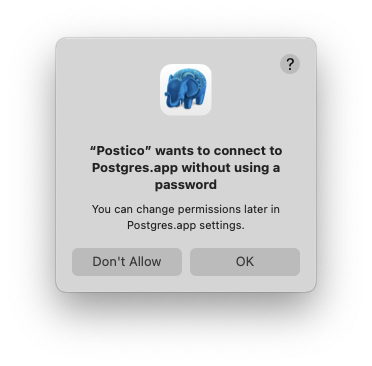
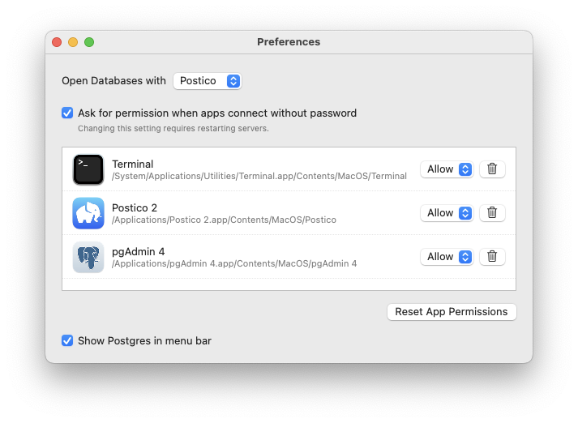

---
redirect_from:
  - /l/app-permissions/
title: Client App Permissions 
---

PostgreSQL Client App Permissions
=================================

By default, PostgreSQL accepts connections from apps on your computer without a password.
This is called the "trust" authentication method.

Permission Dialogs
------------------

To improve the security of PostgreSQL on your Mac, Postgres.app 2.7 and later shows a permission dialog before allowing a client app to connect without a password.

For example, if you use Postico to connect to Postgres.app, you may see a warning like this:

If you click "OK", then Postgres.app will allow the app to connect. Your choice will be remembered in Postgres.app settings, so you will see the dialog only the first time you connect.

If you click "Don't Allow", then Postgres.app will refuse the connection. The client app will show a warning similar to the following:

    connection to server at "localhost" (::1), port 5432 failed: FATAL:  Postgres.app rejected "trust" authentication  
    DETAIL:  You did not allow Postico to connect without a password. For more information see https://postgresapp.com/l/app-permissions/  
    HINT:  Configure app permissions in Postgres.app settings

Additionally, denied connection attempts are shown in the main window of Postgres.app.

Changing Client App Permissions
--------------------------------

If you change your mind, you can change client permissions in Postgres.app settings:

1. Open Postgres.app
2. Choose "Settings" from the "Postgres" menu

* Find the app you want to allow or deny, and change the setting in the popup menu
* Remove apps from the list by clicking the trash can button (this is equivalent to selecting "Ask" in the popup menu)
* Click the "Reset App Permission" button to remove all apps and show the permission dialog again when they make their next connection attempt

Unknown Processes
-----------------

In some cases, Postgres.app might not be able to identify the source of a connection attempt.

If that happens, Postgres.app automatically blocks the passwordless authentication attempt. A warning is shown in the UI, and a message is written to the PostgreSQL server log.

To allow these unknown processes to connect to Postgres.app, we recommend to [configure password authentication](install.html#protecting-postgresql-with-a-password).

"Postgres.app failed to verify trust authentication"
----------------------------------------------------

This message means that PostgreSQL encountered an error when running the helper application that shows the permission dialog.

The most likely reason is that you did not see the permission dialog and PostgreSQL aborted the authentication attempt after 1 minute.

We have also received reports from some users that the helper app crashes for an unknown reason (see [Issue #749](https://github.com/PostgresApp/PostgresApp/issues/749)).
If you experience this bug, please let us know.

Postgres.app 2.7.2 and later let you to approve the app in Postgres.app settings:

1. Open Postgres.app
2. Choose "Settings" from the "Postgres" menu
3. Find the problematic app in the list, and select "Allow" from the popup menu

If the app does not appear in the list, please submit an [issue](https://github.com/PostgresApp/PostgresApp/issues).

Disabling Permission Dialogs
----------------------------

This will reduce the security of your Mac. We recommend to [configure password authentication](install.html#protecting-postgresql-with-a-password) instead of disabling permission dialogs.

You can disable the permission dialogs in Postgres.app settings:

1. Open Postgres.app
2. Choose "Settings" from the "Postgres" menu
3. Uncheck the box labelled "Ask for permission when apps connect without password"
4. Stop running PostgreSQL servers and start them again
5. Postgres.app will now allow passwordless authentication from all apps (if allowed in pg_hba.conf)

This will also allow unknown processes to connect to Postgres.app without using a password.
